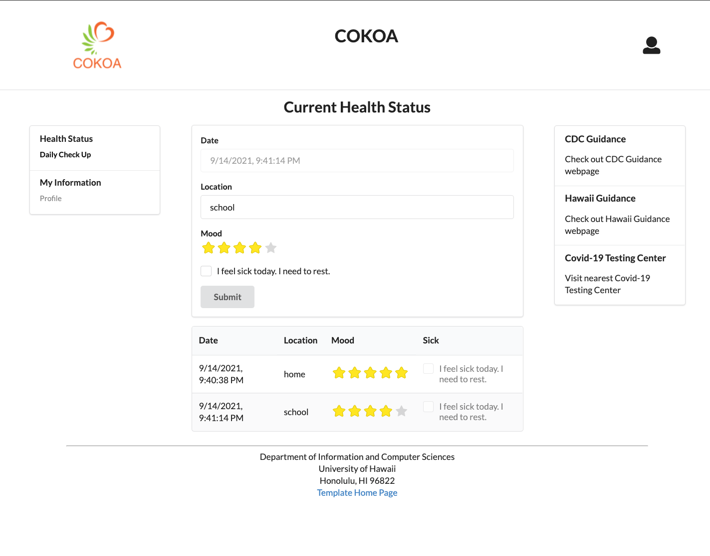

# COKOA

## Table of Contents

* [Cokoa](#cokoa)
* [Developer Guide](#developer-guide)
* [Pages](#pages)
* [Milestones](#milestones)
* [Meet the Team](#meet-the-team)
<br />

## COKOA:

Find the Github Repo here: [Github Repo](https://github.com/ICS491-Team-08/COKOA) <br />

See our deployed Website: [COKOA Website](https://cokoa.meteorapp.com/#/) <br />
<br />

## Developer Guide: 

### Installation

First, [install Meteor](https://www.meteor.com/install).

Second, download [COKOA](https://github.com/ICS491-Team-08/COKOA.github.io), and request permission to gain access to COKOA. 

Third, cd into the app/ directory and install required libraries: meteor:

```
$ meteor npm install
```

### Running the system

After installation, you can run the application by typing:

```
$ meteor npm run start
```
The first time running the application will add default users: 

```
$ meteor npm run start

> meteor-application-template-react@ start /Users/name/Desktop/GitHub/COKOA/app
> meteor --no-release-check --exclude-archs web.browser.legacy,web.cordova --settings ../config/settings.development.json

[[[[[ ~/Desktop/GitHub/COKOA/app ]]]]]        

=> Started proxy.                             
=> Started MongoDB.                           
I20210914-21:22:18.477(-10)? Creating the default user(s)
I20210914-21:22:18.532(-10)?   Creating user admin@foo.com.
I20210914-21:22:18.601(-10)?   Creating user john@foo.com.
I20210914-21:22:18.675(-10)?   Creating user hany7@foo.com.
I20210914-21:22:18.752(-10)? Creating default data.
I20210914-21:22:18.753(-10)?   Adding: Basket (john@foo.com)
I20210914-21:22:18.824(-10)?   Adding: Bicycle (john@foo.com)
I20210914-21:22:18.826(-10)?   Adding: Banana (admin@foo.com)
I20210914-21:22:19.343(-10)? Monti APM: completed instrumenting the app
=> Started your app.

=> App running at: http://localhost:3000/
```
<br />

## PAGES:
These are the designs showcasing each page we have on COKOA.

### Landing Page:

### Register Page:

### Sign-In Page:

### Profile Page:

### Daily Check-up Page: 

Daily check-up shows the current health status. 
You can easily check your current health status with stars and see the history of health status.<br />

### Sign-out Page:

<br />

## MILESTONES:

### Milestone 1:


### Milestone 2:


### Milestone 3:

<br />

## Meet the Team:

[Yong Kim](https://yongkim93.github.io) <br />

[Yeji Han](https://yejihan92.github.io) <br />

[Kai Hwang](https://hwangwooj.github.io) <br />

[Cheolhoon Choi](https://cheolhoon.github.io) <br />


