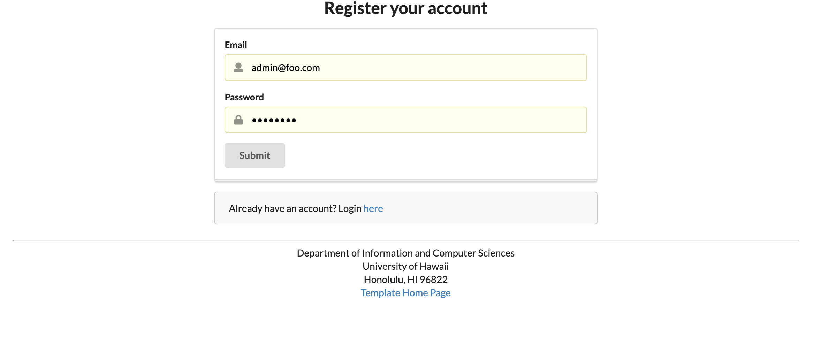
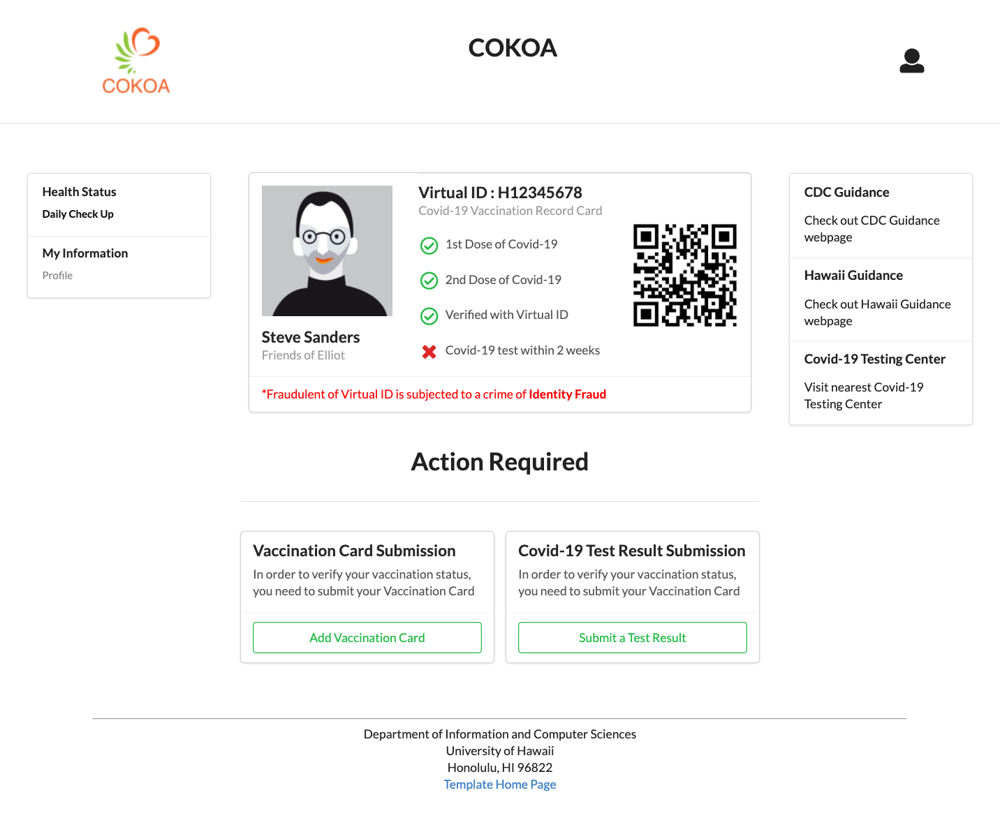
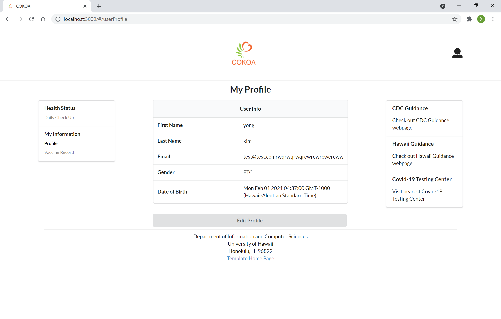
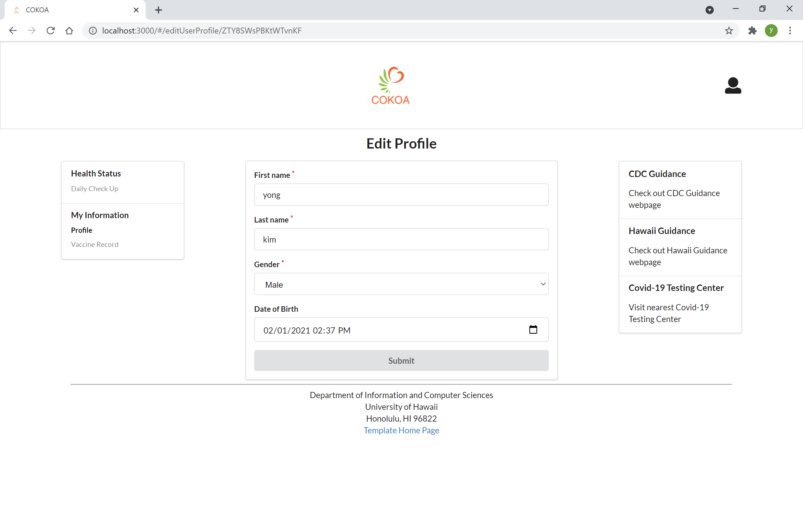
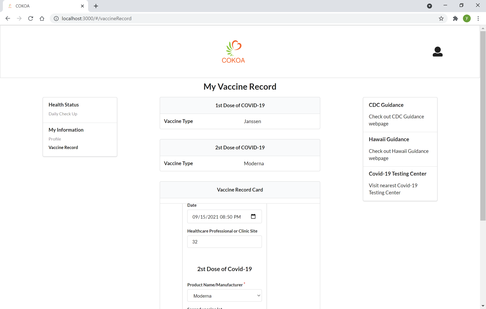
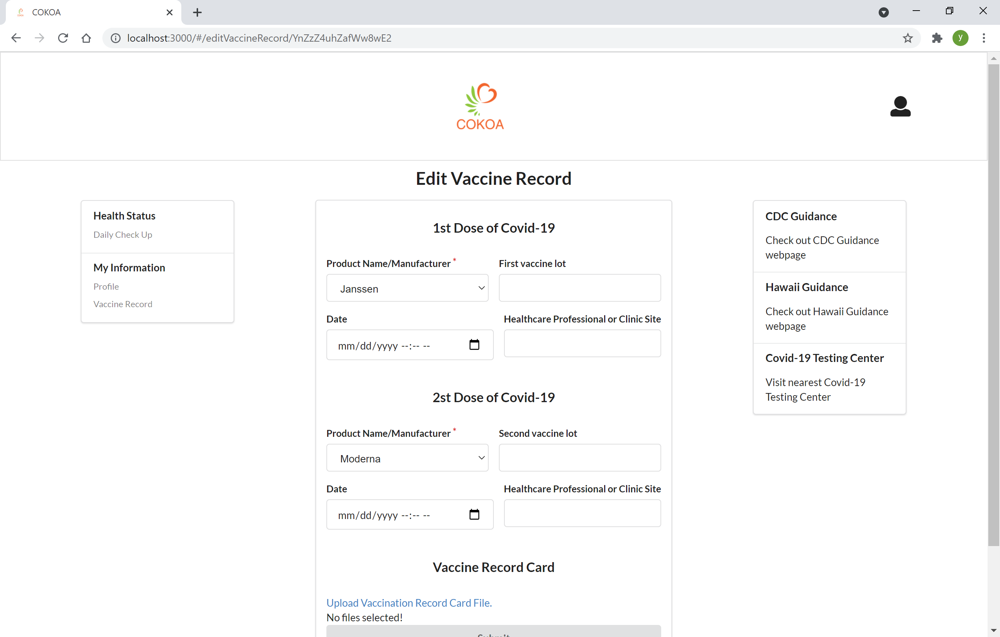
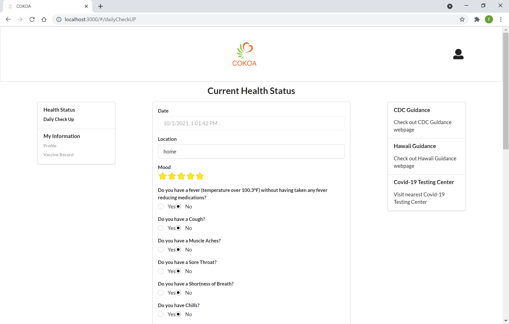
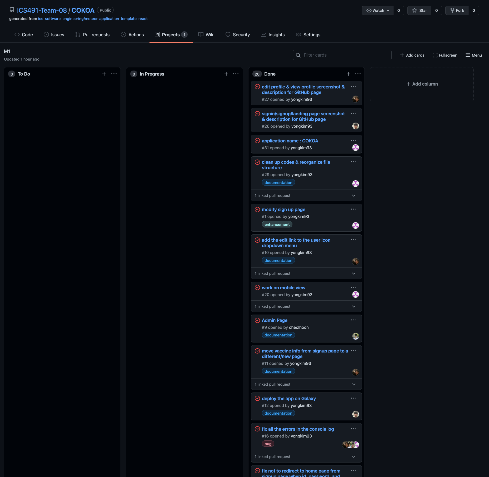
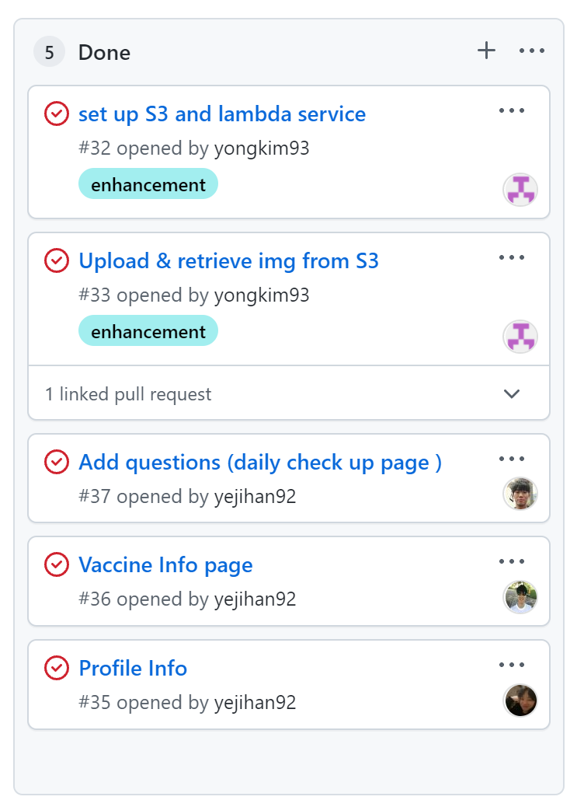

# COKOA

## Table of Contents

* [Cokoa](#cokoa)
* [Developer Guide](#developer-guide)
* [Pages](#pages)
* [Milestones](#milestones)
* [Meet the Team](#meet-the-team)
<br />

## COKOA:

Find the Github Repo here: [Github Repo](https://github.com/ICS491-Team-08/COKOA) <br />

See our deployed Website: [COKOA Website](https://galaxy.meteor.com/app/team-8-cokoa.meteorapp.com) <br />
<br />

## Developer Guide: 

### Installation

First, [install Meteor](https://www.meteor.com/install).

Second, download [COKOA](https://github.com/ICS491-Team-08/COKOA.github.io), and request permission to gain access to COKOA. 

Third, cd into the app/ directory and install required libraries: meteor:

```
$ meteor npm install
```

### Running the system

After installation, you can run the application by typing:

```
$ meteor npm run start
```
The first time running the application will add default users: 

```
$ meteor npm run start

> meteor-application-template-react@ start /Users/name/Desktop/GitHub/COKOA/app
> meteor --no-release-check --exclude-archs web.browser.legacy,web.cordova --settings ../config/settings.development.json

[[[[[ ~/Desktop/GitHub/COKOA/app ]]]]]        

=> Started proxy.                             
=> Started MongoDB.                           
I20210914-21:22:18.477(-10)? Creating the default user(s)
I20210914-21:22:18.532(-10)?   Creating user admin@foo.com.
I20210914-21:22:18.601(-10)?   Creating user john@foo.com.
I20210914-21:22:18.675(-10)?   Creating user hany7@foo.com.
I20210914-21:22:18.752(-10)? Creating default data.
I20210914-21:22:18.753(-10)?   Adding: Basket (john@foo.com)
I20210914-21:22:18.824(-10)?   Adding: Bicycle (john@foo.com)
I20210914-21:22:18.826(-10)?   Adding: Banana (admin@foo.com)
I20210914-21:22:19.343(-10)? Monti APM: completed instrumenting the app
=> Started your app.

=> App running at: http://localhost:3000/
```
<br />

## PAGES:
These are the designs showcasing each page we have on COKOA.

### Landing Page:

A landing page is the first page for users to interact with our website. It has buttons for log-in and sign-up.<br />

### Register Page:

A sign-up page allows users to create a new account using their email address and password. <br />

### Sign-In Page:

A sign-in page allows users to log in with their existing account. <br />

### Home Page:

This page is the main page that shows the overall status of the user after registration or login.
It shows the user's vaccination status and the results of the COVID-19 test.<br />
Users can also upload their vaccine cards or the results of the COVID-19 test within two weeks.<br />

### Profile Page:


The profile page allows users to register and enter first name, last name, email, gender, and birthday to view their profile. The profile page contains basic information about the user. To add or modify the information displayed in the profile, users can first go to their "My Profile" and then edit the information they entered by clicking the "Edit Profile" button at the bottom. Users can easily complete all tasks by pressing the "Submit" button after completing the information to be modified.<br />

### Vaccine Record Page:


The vaccine record page allows users to enter their vaccination information such as type, lot, date, and site. To add or modify the information displayed in the vaccine record, users can first go to their "Vaccine Record" and then edit the information they entered by clicking the "Edit Vaccine Record" button at the bottom. Users can easily complete all tasks by pressing the "Submit" button after completing the information to be modified. <br />

### Daily Check-up Page: 

The daily check-up page shows the current health status. 
Users can easily check their current health status with stars and see the history of health status.<br />
<br />

## MILESTONES:

### Milestone 1:
Here is our [Milestone-1](https://github.com/ICS491-Team-08/COKOA/projects/1). <br />


### Milestone 2:
Here is our [Milestone-2](https://github.com/ICS491-Team-08/COKOA/projects/2). <br />


### Milestone 3:

<br />

## Meet the Team:

[Yong Kim](https://yongkim93.github.io) <br />

[Yeji Han](https://yejihan92.github.io) <br />

[Kai Hwang](https://hwangwooj.github.io) <br />

[Cheolhoon Choi](https://cheolhoon.github.io) <br />


